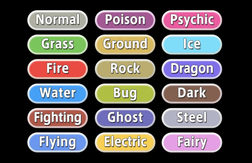
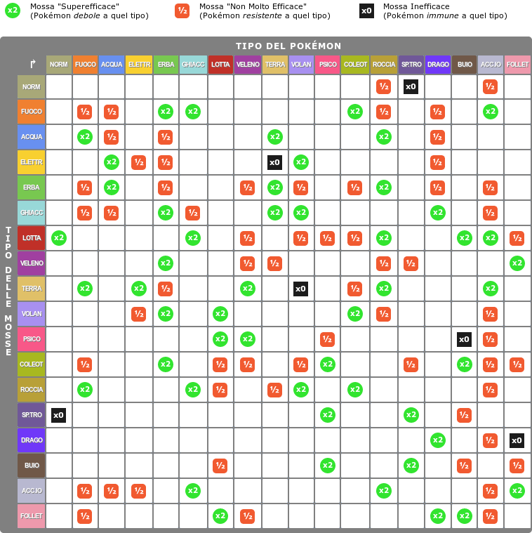

```{r setup, echo= FALSE}
knitr::opts_chunk$set(cache = FALSE, message = FALSE, warning = FALSE, echo = FALSE)
```

## Introduzione ai Pokémon 

> "Cosa faccio io? Conduco delle ricerche in modo che possiamo imparare di più sui Pokémon...  
> Sono sicuro che lungo il percorso scoprirai molte cose, forse anche qualcosa di te stesso."  
>
> `r tufte::quote_footer('--- Prof. Rowan')`

<div align="center">  </div>

## Cosa analizzeremo?

- Qual è il tipo più forte nel complesso? Qual è il più debole? 

- Qual è il doppio tipo esistente nel complesso il più forte? Qual è il più debole?  

- Qual è il tipo più probabile che sia un Pokémon leggendario?  

- Come si correla l'altezza e il peso di un Pokémon con le sue varie statistiche di base?   

- Si può costruire un dream team Pokémon?<br>Una squadra di 6 Pokémon che rimane relativamente impenetrabile a qualsiasi altra squadra di 6 Pokémon.

---

## Qual è il tipo più forte nel complesso?<br>Qual è il più debole? 

{.centered width="50%"}

--- 

{.centered width="45%"}

---

```{r include=FALSE}
library(readr)
library(dplyr)
library(tidyr)
library(ggplot2)
library(modelr)
library(ggpubr)
library(knitr)
library(kableExtra)
library(viridisLite)
library(DiagrammeR)

## Set completo dei dati sui Pokémon
set <- read.csv("./sets/Pokedex_Ver3.csv")

## Set con le debolezze dei Pokémon
aux_set <- read.csv("./sets/dataset_pokemon.csv")

set <- set %>%
  filter(GENERATION <= 7)

```

```{r out.extra='class="centered"', fig.width=10}
weak_table <- aux_set %>%
  select(type1, type2, contains("against")) %>%
  filter(type2 == "") %>%
  distinct() %>% ## make only one type for row because are identicaly
  select(-type2) %>%
  rename(type = type1)

sum <- weak_table %>%
  select(-type) %>%
  rowSums()

weak_table <- weak_table %>%
  select(-contains("against")) %>%
  mutate(sum = sum) %>%
  arrange(sum) %>%
  mutate(type=factor(type, levels=type)) %>%
  rename(
    Type = type,
    "Weak Point" = sum
  )

cols_min <- c("bug"="#A8B820",
"dark"="#705848",
"dragon"="#7038F8",
"electric"="#F8D030",	
"fairy"="#EE99AC",
"fighting"="#C03028",
"fire"="#F08030",
"flying"="#A890F0",
"ghost"="#705898",
"grass"="#78C850",
"ground"="#E0C068",
"ice"="#98D8D8",	
"normal"="#A8A878",
"poison"="#A040A0",
"psychic"="#F85888",
"rock"="#B8A038",
"steel"="#B8B8D0",	
"water"="#6890F0")

ggplot(weak_table) +
  geom_col(mapping = aes(Type, `Weak Point`, fill=Type)) +
  scale_fill_manual(values = cols_min) +
  xlab("") + ylab("") +
  theme(
    plot.title = element_text(hjust=0.5, margin = margin(20,0,20,0)),
    legend.position = "none"
  ) +
  ggtitle("Somma dei Moltiplicatori di Danno")
  
```


## Qual è il doppio tipo esistente nel complesso il più forte?<br>Qual è il più debole? 

```{r results = 'asis'}
double_weak_table <- aux_set %>%
  select(type1, type2, contains("against")) %>%
  filter(type2 != "") %>%
  distinct()

sum <- double_weak_table %>%
  select(-contains("type")) %>%
  rowSums()

double_weak_table <- double_weak_table %>%
  select(-contains("against")) %>%
  mutate(sum = sum) %>%
  arrange(sum) %>%
  rename(
    "Type 1" = type1,
    "Type 2" = type2,
    "Weak Point" = sum
  )


knitr::kables(
  list(
    knitr::kable(head(double_weak_table), align = "c") %>%
      kable_paper(full_width = T),
    knitr::kable(slice_tail(double_weak_table, n = 6), align = "c") %>%
      kable_paper(full_width = T)
  ),
)
```


## Qual è il tipo più probabile che sia un Pokémon leggendario?


```{r fig.width=10, out.extra='class="centered"'}
legendary <- set %>%
  select(NAME, TYPE1, TYPE2, LEGENDARY) %>%
  filter(LEGENDARY == TRUE) %>%
  distinct() ## necessario poichè alucni pokemon come Deoxsy cambiano forma ma non tipo

t1 <- as.data.frame(table(legendary$TYPE1)) 
t2 <- as.data.frame(table(legendary$TYPE2, exclude = "")) 

# Il full join serve perchè si ha due tabelle distinte e vogliamo vedere i valori accoppiati, 
# così da poterli sommare
legendary_type_sum <- full_join(t1, t2, by = "Var1") %>%
  select(-Var1) %>%
  rowSums()

legendary_type <- t1 %>%
  rename(Type = Var1) %>%
  select(-Freq) %>%
  mutate(Freq = legendary_type_sum) %>%
  arrange(Freq) %>%
  mutate(Type=factor(Type, levels=Type))

cols_max <- c("Bug"="#A8B820",
"Dark"="#705848",
"Dragon"="#7038F8",
"Electric"="#F8D030",	
"Fairy"="#EE99AC",
"Fighting"="#C03028",
"Fire"="#F08030",
"Flying"="#A890F0",
"Ghost"="#705898",
"Grass"="#78C850",
"Ground"="#E0C068",
"Ice"="#98D8D8",	
"Normal"="#A8A878",
"Poison"="#A040A0",
"Psychic"="#F85888",
"Rock"="#B8A038",
"Steel"="#B8B8D0",	
"Water"="#6890F0")

ggplot(na.omit(legendary_type), aes(x=Type, y=Freq, size=Freq, color=Type)) +
  geom_segment(aes(x=Type, xend=Type, y=0, yend=Freq, size=1), color="grey") +
  geom_point() +
  scale_colour_manual(values = cols_max) +
  theme_light() +
  theme(
    panel.grid.major.x = element_blank(),
    panel.border = element_blank(),
    axis.ticks.x = element_blank(),
    plot.title.position = "plot",
    plot.title = element_text(hjust=0.5, margin = margin(20,0,20,0)),
    legend.position = "none"
  ) +
  scale_size(range = c(1, 7)) +
  ggtitle("Frequenza dei Tipi nei Pokèmon Leggendari") +
  xlab("") + ylab("")
```

## Come si correla l'altezza e il peso di un Pokémon con le sue varie statistiche di base?  

{.centered}

## Correlazione Lineare
```{r out.extra='class="centered"', fig.width=10}
library(corrplot)

par(mfrow=c(2,1))
# Correlazione tra altezza e gli stati
corrplot(cor(set$HEIGHT, set[, c(16:21)]),
  method = "number",
  type = "upper", 
  title = "Altezza",
  mar = c(1, 1, 1, 1)
)
# Correlazione tra peso e gli stati
corrplot(cor(set$WEIGHT, set[, c(16:21)]),
  method = "number",
  type = "upper",
  title = "Peso",
  mar = c(1, 1, 1, 1)
)
```

## Correlazione Quadratica
```{r out.extra='class="centered"',fig.width=10}

quad_height <- set[, c(14)] ^ 2
quad_weight <- set[, c(15)] ^ 2

par(mfrow=c(2,1))

corrplot(cor(quad_height, set[, c(16:21)]),
  method = "number",
  type = "upper",
  title = "Altezza",
  mar = c(1, 1, 1, 1)
)

corrplot(cor(quad_weight, set[, c(16:21)]),
  method = "number",
  type = "upper",
  title = "Peso",
  mar = c(1, 1, 1, 1)
)
```

## Correlazione Logaritmica
```{r out.extra='class="centered"',fig.width=10}
log_height <- set[, c(14)] %>% log()
log_weight <- set[, c(15)] %>% log()

par(mfrow=c(2,1))
corrplot(cor(log_height, set[, c(16:21)]),
  method = "number",
  type = "upper",
  title = "Altezza",
  mar = c(1, 1, 1, 1)
)
corrplot(cor(log_weight, set[, c(16:21)]),
  method = "number",
  type = "upper",
  title = "Peso",
  mar = c(1, 1, 1, 1)
)

```

---

```{r out.extra='class="centered"',fig.width=15}

height_plot <- ggplot(data = set, mapping = aes(log_height, ATK)) +
  geom_point() +
  geom_smooth(method = "loess", formula = "y ~ x") +
  xlab("Log Height") + ylab("Atk")

weight_plot <- ggplot(data = set, mapping = aes(log_weight, ATK)) +
  geom_point() +
  geom_smooth(method = "loess", formula = "y ~ x") +
  xlab("Log Weight") + ylab("Atk")

ggarrange(height_plot, weight_plot, ncol = 2, nrow = 1, align = "h")
```


## Si può costruire un dream team Pokémon?<br>Una squadra di 6 Pokémon che rimane relativamente impenetrabile a qualsiasi altra squadra di 6 Pokémon.

> "L'ultimo passo è di gran lunga il più difficile. 
> Anche se è vero che ci sono dei set di mosse "standard" per ogni Pokémon, 
> il più difficile è far lavorare tutti insieme i tuoi Pokémon, 
> non solo per trovare le mosse giuste per il tuo Pokémon."

## Il meno vulnerabile
```{r}
best_candidates <- aux_set %>%
  select(name, contains("against"))

 best_candidates <- best_candidates %>%
  filter(rowSums(best_candidates == 0) > 0)
 
 best_candidates <- best_candidates %>%
  rowwise() %>%
  mutate(Sum = sum(c_across("against_bug":"against_water"))) %>%
  arrange(Sum)
 
dream_team <- head(best_candidates, 1)

knitr::kable(dream_team %>% select(-name, -Sum), col.names = gsub("against_", "", names(dream_team %>% select(-name, -Sum))), align = "c") %>%
  kable_paper(bootstrap_options = "striped", full_width = F)
```

{.dream_team}

## Nuovo Membro
```{r}
new_member <- best_candidates %>%
  filter(against_ground == 0) %>%
  arrange(Sum) %>%
  head(1)

dream_team <- rbind(dream_team, new_member)

knitr::kable(dream_team %>% select(-name, -Sum), col.names = gsub("against_", "", names(dream_team %>% select(-name, -Sum))), align = "c") %>%
  kable_paper(bootstrap_options = "striped", full_width = F)
```

{.dream_team style="left: 30%;"}
{.dream_team style="left: 70%;"}

## Team finale
```{r}
new_member <- best_candidates %>%
  filter(against_fire == 0.5) %>%
  arrange(Sum) %>%
  head(1)

dream_team <- rbind(dream_team, new_member)

new_member <- best_candidates %>%
  filter(against_electric == 0) %>%
  arrange(Sum) %>%
  head(1)

dream_team <- rbind(dream_team, new_member)

new_member <- best_candidates %>%
  filter(against_fight == 0) %>%
  arrange(Sum) %>%
  head(1)

dream_team <- rbind(dream_team, new_member)

new_member <- best_candidates %>%
  filter(against_water == 0.5) %>%
  arrange(Sum) %>%
  head(2) ## Sarebbe Dialga, però considerare pokemon leggendari nella ricerca non è funzionale al fine di tale, pertanto usaimo il secondo che è anche uno starter 

dream_team <- rbind(dream_team, new_member[2, ])

dream_team[3,] <-best_candidates %>%
  filter(name == "Azumarill")

dream_team[5,] <-best_candidates %>%
  filter(name == "Aegislash")

final_team <- aux_set %>%
  filter(name %in% dream_team$name)  %>%
  select(name, type1, type2, hp, attack, defense, speed, sp_attack, sp_defense)

final_team[1,] <-aux_set %>%
  select(name, type1, type2, hp, attack, defense, speed, sp_attack, sp_defense) %>%
  filter(name == "Azumarill")

final_team[6,] <-aux_set %>%
  select(name, type1, type2, hp, attack, defense, speed, sp_attack, sp_defense) %>%
  filter(name == "Aegislash")

df_image <- data.frame(
  c0 = c("1", "2"),  
  c1 = "",
  c2 = "",
  c3 = ""
)

knitr::kable(final_team, align = "c") %>%
  kable_paper(bootstrap_options = "striped", full_width = F)
```

```{r}
knitr::kable(df_image %>% select(-c0), 
             align = "c", 
             col.names = NULL, 
             table.attr = "class=\"kable_wrapper\" style=\"top: 75%;\"") %>%
    column_spec(1, image = spec_image(c("./img/azumarill.png", "./img/steelix.png"), 475, 475)) %>%
    column_spec(2, image = spec_image(c("./img/skarmory.png", "./img/mawile.png"), 475, 475)) %>%
    column_spec(3, image = spec_image(c("./img/empoleon.png", "./img/aegislash.png"), 475, 475))

```

## È effetivamente un dream team?

```{r fig.width=10, out.extra='class="centered"'}
library(plyr)

dream_team %>%
  select(-name) %>%
  ldply(function(c) sum(c==2)) %>%
  filter(V1 >= 1) %>%
  ggplot( aes(x=.id, y=V1, fill= V1)) + 
    geom_bar(stat="identity") + 
    labs(fill = "Intensity") +
    xlab("") + ylab("") 
  
```


## Bibliografia

* Kaggle

  - [Dataset con i Moltiplicatori di Danno](https://www.kaggle.com/rounakbanik/pokemon)
  
  - [Dataset Completo](https://www.kaggle.com/takamasakato/pokemon-all-status-data) 

* [Pokèdex](https://www.pokemon.com/it/pokedex/)

* [Wikipedia](https://wiki.pokemoncentral.it/)

* [Squadra Competitiva](https://strategywiki.org/wiki/Pok%C3%A9mon/Competitive_battling/Making_a_Team)


