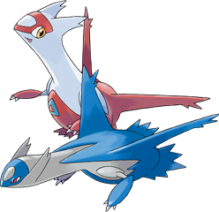

```{r setup, include=FALSE}
knitr::opts_chunk$set(cache = TRUE, message = FALSE, warning = FALSE)
```

## {data-background-video="./img/intro_pokemon.mp4"}


## Introduzione ai pokemon

> "Questo mondo è ampiamente abitato da creature conosciute come Pokémon. Qui ho una Poké Ball...  
Noi umani viviamo accanto ai Pokémon come amici. A volte giochiamo insieme, altre volte lavoriamo insieme. 
Alcune persone usano i loro Pokémon per combattere e sviluppare legami più stretti con loro.  
Cosa faccio io? Conduco delle ricerche in modo che possiamo imparare di più sui Pokémon...  
Sono sicuro che lungo il percorso scoprirai molte cose, forse anche qualcosa di te stesso.  
Ora, vai avanti, fai un salto nel mondo dei Pokémon!"


## Cosa analizzeremo?
- Qual è il tipo più forte nel complesso? Qual è il più debole? 

- Qual è il doppio tipo esistente nel complesso il più forte? Qual è il più debole?  

- Qual è il tipo più probabile che sia un Pokemon leggendario?  

- Come si correla l'altezza e il peso di un Pokemon con le sue varie statistiche di base?   

- Si può costruire un dream team Pokemon?<br>Una squadra di 6 Pokemon che rimane relativamente impenetrabile a qualsiasi altra squadra di 6 Pokemon.

---

## Qual è il tipo più forte nel complesso? Qual è il più debole?


---

{width=70%}

---

```{r include=FALSE}
library(readr)
library(dplyr)
library(tidyr)
library(ggplot2)
library(modelr)

## Set completo dei dati sui Pokemon
set <- read.csv("./sets/Pokedex_Ver3.csv")

## Set con le debolezze dei pokemon
aux_set <- read.csv("./sets/dataset_pokemon.csv")

set <- set %>%
  filter(GENERATION <= 7)

```

```{r results = 'asis', echo=FALSE}
weak_table <- aux_set %>%
  select(type1, type2, contains("against")) %>%
  filter(type2 == "") %>%
  distinct() %>% ## make only one type for row because are identicaly
  select(-type2) %>%
  rename(type = type1)

sum <- weak_table %>%
  select(-type) %>%
  rowSums()

weak_table <- weak_table %>%
  select(-contains("against")) %>%
  mutate(sum = sum) %>%
  arrange(sum) %>%
  rename(
    Type = type,
    "Weak Point" = sum
  )

knitr::kable(weak_table, caption = "Tabella delle debolezze")
```


## Qual è il doppio tipo esistente nel complesso il più forte? Qual è il più debole?

---

```{r results = 'asis', echo=FALSE}
double_weak_table <- aux_set %>%
  select(type1, type2, contains("against")) %>%
  filter(type2 != "") %>%
  distinct()

sum <- double_weak_table %>%
  select(-contains("type")) %>%
  rowSums()

double_weak_table <- double_weak_table %>%
  select(-contains("against")) %>%
  mutate(sum = sum) %>%
  arrange(sum) %>%
  rename(
    "Type 1" = type1,
    "Type 2" = type2,
    "Weak Point" = sum
  )

knitr::kable(list(head(double_weak_table), slice_tail(double_weak_table, n=6)))

```


{width=40%}
{width=40%}

## Qual è il tipo più probabile che sia un Pokemon leggendario?


---


```{r echo=FALSE}
legendary <- set %>%
  select(NAME, TYPE1, TYPE2, LEGENDARY) %>%
  filter(LEGENDARY == TRUE) %>%
  distinct() 

t1 <- as.data.frame(table(legendary$TYPE1)) 
t2 <- as.data.frame(table(legendary$TYPE2, exclude = "")) 

legendary_type_sum <- full_join(t1, t2, by = "Var1") %>%
  select(-Var1) %>%
  rowSums()

legendary_type <- t1 %>%
  rename(Type = Var1) %>%
  select(-Freq) %>%
  mutate(Freq = legendary_type_sum) %>%
  arrange(-Freq)

knitr::kable(head(legendary_type))
```

{width=20%}
{width=20%}
{width=40%}


## Come si correla l'altezza e il peso di un Pokemon con le sue varie statistiche di base?  


immagine evoluzioni

## Correlazione Lineare

```{r fig, fig.height = 10, fig.width = 15, fig.align = "center", echo=FALSE}
library(corrplot)

par(mfrow=c(2,1))

corrplot(cor(set$HEIGHT, set[, c(16:21)]),
  method = "number",
  type = "upper", 
)

corrplot(cor(set$WEIGHT, set[, c(16:21)]),
  method = "number",
  type = "upper",
)
```

## Corrleazione Logaritimica
```{r fig.height = 10, fig.width = 15, fig.align = "center", echo=FALSE}
log_height <- set[, c(14)] %>% log()
log_weight <- set[, c(15)] %>% log()

par(mfrow=c(2,1))
corrplot(cor(log_height, set[, c(16:21)]),
  method = "number",
  type = "upper"
)
corrplot(cor(log_weight, set[, c(16:21)]),
  method = "number",
  type = "upper" 
)

```

---

```{r fig.height = 8, fig.width = 20, fig.align = "center", echo=FALSE}
library(ggpubr)

height_plot <- ggplot(data = set, mapping = aes(log_height, ATK)) +
  geom_point() +
  geom_smooth(method = "loess", formula = "y ~ x")

weight_plot <- ggplot(data = set, mapping = aes(log_weight, ATK)) +
  geom_point() +
  geom_smooth(method = "loess", formula = "y ~ x")

ggarrange(height_plot, weight_plot, ncol = 2, nrow = 1, align = "h")
```


## Si può costruire un dream team Pokemon?<br>Una squadra di 6 Pokemon che rimane relativamente impenetrabile a qualsiasi altra squadra di 6 Pokemon.


